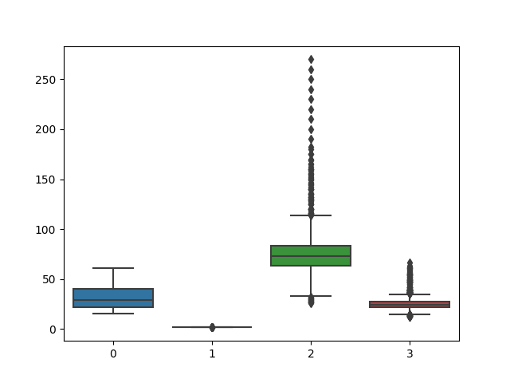

# This is the generated report for summary statistics and data visualization for [bmi.csv](https://github.com/nogibjj/as1466_week2_DE/blob/main/bmi.csv) file

## Overall dataset descriptive statistics

|    | describe   |      Age |      Height |   Weight |       Bmi | BmiClass      |
|---:|:-----------|---------:|------------:|---------:|----------:|:--------------|
|  0 | count      | 741      | 741         | 741      | 741       | 741           |
|  1 | null_count |   0      |   0         |   0      |   0       | 0             |
|  2 | mean       |  31.6181 |   1.70943   |  78.4125 |  26.3654  |               |
|  3 | std        |  11.6555 |   0.0859744 |  32.2545 |   9.22319 |               |
|  4 | min        |  15      |   1.46      |  25.9    |  12.1505  | Normal Weight |
|  5 | 25%        |  22      |   1.67      |  63      |  22.1297  |               |
|  6 | 50%        |  29      |   1.721     |  72.9    |  24.1324  |               |
|  7 | 75%        |  40      |   1.751     |  83.3    |  27.2493  |               |
|  8 | max        |  61      |   2.07      | 270      |  66.3013  | Underweight   |

## Here are some data visualizations of data to understand relationships between variables

### Boxplots of each variable

### Pairplots of correlation between numerical variables, segmented by BMI segment

